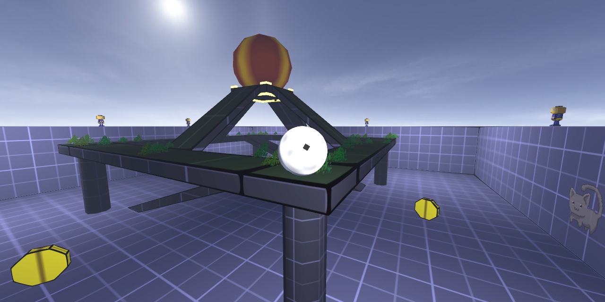

# Game template for [godot-mapper](https://github.com/ELF32bit/godot-mapper) plugin
 
The rolling ball type of game is perfect for beginners to play with. 
Unfortunately, even a simple game like that requires quite many directories. 
Set **`Generic`** game path to the project **`mapping`** directory in **TrenchBroom**. 

## Project directories
* **`addons`** is a directory for modular code (plugins, tools).
* **`application`** should contain application files and global settings.
* **`characters`** contains [special maps](https://github.com/ELF32bit/godot-mapper-characters) with animated layers for prototyping.
* **`interfaces`** should contain all kinds of buttons, progress bars, etc...
* **`mapping`** is the main directory for game levels with map resources.
* **`sources`** should contain all game logic and the game state.
